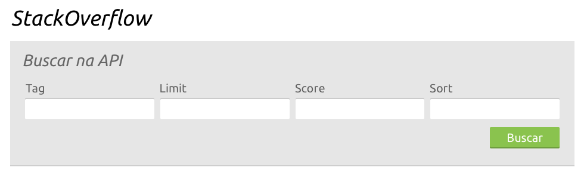

* Criar sua própria API GraphQL e
* Uma aplicação web que mostra dados do StackOverflow.

Para começar, você deve criar uma API GraphQL que funcione como uma interface intermediária para a API de question do StackOverflow. 
Essa chamada de API precisa receber como input 4 parâmetros:

* O parâmetro 'score' deve filtrar o resultado mostrando apenas as questões com valor maior que o definido por parâmetro. 
* O parâmetro 'sort' define a propriedade utilizada para ordenar os resultados.  
* O parâmetro 'limit' define o número de resultados.
* O parâmetro 'tag' define a tag que você quer buscar

Apenas o parâmetro 'tag' precisa ser obrigatório. Para os outros parâmetros, defina um valor default.
A segunda parte do desafio consiste em implementar a seguinte interface:

Ao clicar em buscar, você deve consultar a API GraphQL que você implementou e mostrar os resultados abaixo, na mesma página, sem recarregá-la. Sua busca deve sempre trazer resultados para a tag 'Javascript'.